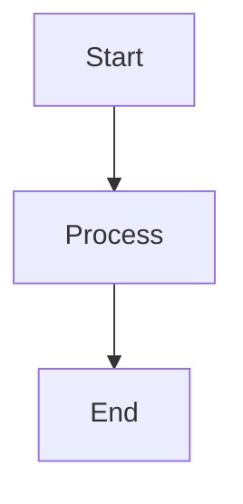
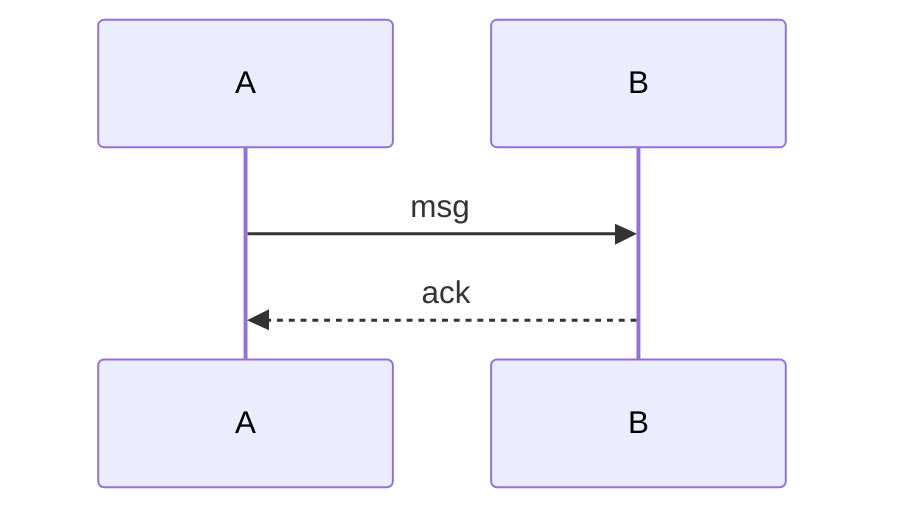
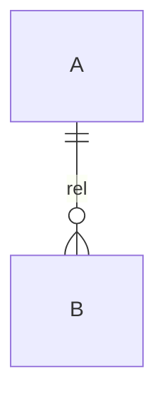
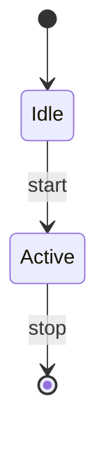

# Mermaid Diagrams

Produce architecture, flowchart, sequence, and ER diagrams from a plain-text description or from existing source code. Rendering is local via the mermaid MCP server (playwright + mermaid-isomorphic), so no external API key is required.

## When to Use

- You need to explain a system's architecture or component relationships.
- You are describing a temporal or messaging flow (sequence of calls).
- You want to summarize a data model (entities and relationships).
- You are documenting a state machine or a decision flow.
- A diagram communicates structure more clearly than prose.

Do NOT use when a single short sentence already conveys the idea — generating a diagram adds overhead without value.

## Prerequisites

The mermaid MCP server must be configured. The rendering tool is `mcp_mermaid_render_mermaid`. No API key is needed — rendering is fully local.

## Procedure

1. Decide the diagram type from the intent:

   | Intent | Diagram type |
   |---|---|
   | Architecture / component flow | `graph` (flowchart) |
   | Temporal / messaging | `sequenceDiagram` |
   | Data model | `erDiagram` |
   | State transitions | `stateDiagram-v2` |

2. Draft the mermaid spec with concise, correct syntax. Keep node ids short and put labels with special characters in quotes.

   ```mermaid
   graph TD
     A[Client] --> B(Gateway)
     B --> C{Auth?}
     C -->|yes| D[Service]
     C -->|no| E[Reject]
   ```

   ```mermaid
   sequenceDiagram
     participant U as User
     participant S as Server
     U->>S: Request
     S-->>U: Response
   ```

   ```mermaid
   erDiagram
     USER ||--o{ ORDER : places
     ORDER ||--|{ LINE_ITEM : contains
   ```

3. Call `mcp_mermaid_render_mermaid` with the spec. Choose `outputType`:
   - `base64` (default) — inline PNG bytes.
   - `file` — auto-saves a PNG to the current working directory with a timestamped name.
   - `svg` — raw SVG text you can write to a `.svg` file yourself.
   - `svg_url` / `png_url` — shareable mermaid.ink links.

4. If rendering fails, the tool validates syntax. Fix the reported issue and retry — this is iterative.

5. Save the result: use `outputType: "file"` for an auto-saved PNG, or `outputType: "svg"` then write the returned SVG text to a `.svg` file yourself.

## Quick Reference

Tool signature:

```
mcp_mermaid_render_mermaid(
  mermaid: string,            # mermaid syntax spec
  outputType: base64|svg|mermaid|file|svg_url|png_url,
  theme: default|dark|forest|neutral|base,
  backgroundColor: string,    # optional, e.g. "white"
)
```

Templates:









## Pitfalls

- Very large graphs render as unreadable PNGs — split or summarize first.
- Mermaid syntax is strict; unquoted labels with special characters break parsing.
- `file` output writes to the current working directory with an auto-generated name, so set cwd deliberately.
- HTML or markdown inside node labels varies by renderer — test before relying on it.
- `classDef` and styling directives can bloat the spec; keep them minimal.

## Verification

- The tool returns image bytes, a file path, a URL, or SVG text depending on `outputType`.
- For `svg`, confirm the returned string starts with `<svg`.
- For `file`, confirm the returned absolute path exists on disk.
- Eyeball that node labels and edges match the intended structure before accepting the result.